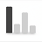
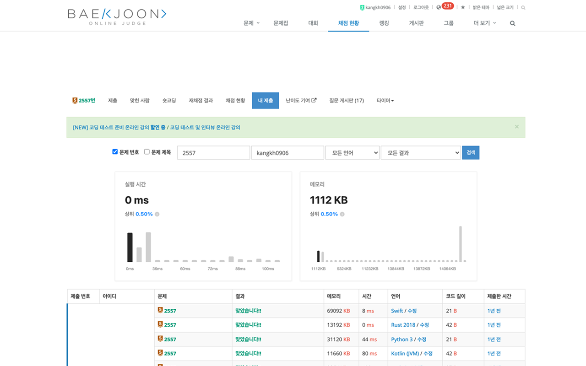
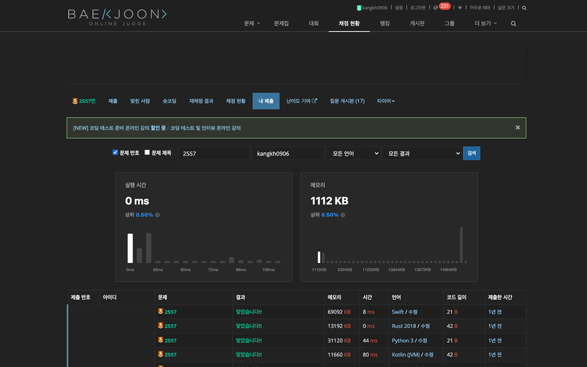

# BOJ Performance

백준 온라인 저지(BOJ)의 채점 현황 페이지에서 내 코드의 실행 시간과 메모리 위치를 직관적인 그래프로 확인하세요.  

## ✨ 주요 기능

### 📊 1. 성능 시각화 그래프
- 실행 시간(ms)과 메모리(KB) 분포를 막대 그래프로 보여줍니다.
- 전체 제출자 중 내 코드의 위치를 한 눈에 파악할 수 있습니다.

### 🏆 2. 상위 퍼센트 확인
- "상위 15.20% (최근 200건 기준)"과 같이 객관적인 지표를 제공합니다.
- 내 코드가 얼마나 효율적인지 즉시 알 수 있습니다.

### 🔄 3. 언어별 필터링 자동 연동
- 백준 페이지 상단의 [언어] 필터를 변경하고 검색하면, 그래프도 해당 언어 통계로 자동 업데이트됩니다.
- 예: Python 3 선택 시 -> Python 3 제출자들 내에서의 내 위치를 보여줍니다.

### 🌙 4. 다크 모드 지원
- 브라우저/OS 시스템 설정에 따라 자동으로 다크 모드가 적용됩니다.
- boj-extended 익스텐션의 다크 모드 설정도 감지하여 연동됩니다.

## 👀 미리보기

| 라이트 모드 | 다크 모드 |
| :---: | :---: |
|  |  |

## 🚀 설치 방법

### 방법 1: Chrome 웹 스토어
1. [Chrome 웹 스토어 링크](https://chromewebstore.google.com/detail/boj-performance/bklabnmnfggmenngdnlndikconflcbij)에 접속합니다.
2. "Chrome에 추가" 버튼을 클릭합니다.

### 방법 2: 수동 설치
1. 이 저장소를 `git clone` 하거나 ZIP으로 다운로드하여 압축을 풉니다.
2. 크롬 브라우저 주소창에 `chrome://extensions`를 입력하여 이동합니다.
3. 우측 상단의 '개발자 모드'를 켭니다.
4. '압축해제된 확장 프로그램을 로드합니다' 버튼을 클릭합니다.
5. 다운로드 받은 폴더 내 src 폴더를 선택합니다.

## 🐛 버그 제보 및 기여

Issue와 Pull Request를 통한 버그 제보 및 새로운 기능 제안은 언제나 환영입니다!

## 📜 License

This project is licensed under the [MIT License](./LICENSE)  
This project uses [Chart.js](https://www.chartjs.org/), which is licensed under the MIT License.
